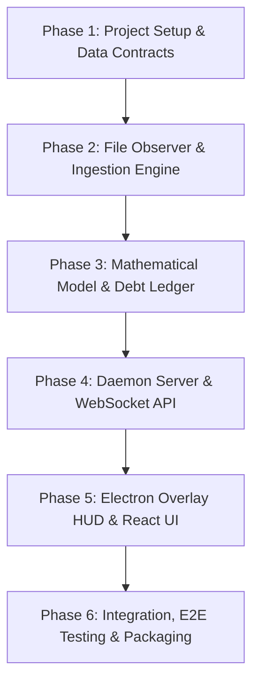

# Slay the Spire 2 Workout Mode Helper — Concrete Implementation Plan

## Executive Overview
The **Slay the Spire 2 Workout Mode Helper (v1.1.0)** is an out-of-process companion daemon and transparent Electron overlay HUD. It monitors StS2 save file updates, computes per-player workout debt after every floor based on combat turns and health loss, manages workout resolution (push-ups / squats), and handles run lifecycle events (start opt-in, victory recaps, and 24-hour defeat jog penalties).

---

## Technical Stack & Architecture Alignment

* **Backend Daemon**: Node.js + TypeScript (`express`, `ws` WebSockets, `chokidar` file watcher).
* **Frontend Overlay**: Electron + React + Vite + Tailwind CSS (Frameless transparent window with click-through toggle).
* **Save File Engine**: File system watcher with 75ms debounce, SHA-256 payload deduplication, and exponential backoff retry loop for file locks (`EBUSY`).
* **Testing & Simulation**: `samples/` fixture library + CLI Simulator (`npm run simulate:step`) for end-to-end testing without StS2 running.
* **Local Persistence**: `active_session.json` (active debt, ratio, active 24h jog countdown) and `workout_history.json` (lifetime aggregates & run recaps).

---

## Phase-by-Phase Implementation Roadmap



---

### Phase 1: Project Setup, Schemas & Sample Save Fixtures
**Goal:** Establish workspace structure, TypeScript data models, and sample StS2 save files.

#### Step 1.1: Project Initialization
* Initialize a monorepo or standard package structure:
  * `src/daemon/` (Watcher, ledger engine, WebSocket/REST server)
  * `src/overlay/` (Electron window manager, React HUD UI)
  * `src/shared/` (TypeScript types, interfaces, API contracts)
  * `samples/` (Sample save files representing run progression)

#### Step 1.2: Shared TypeScript Types & Data Contracts
Define canonical interfaces matching `architecture.md`:
* `FloorMetrics`, `PlayerStats`, `WorkoutCounterFormula`
* `WebSocketEvent` types (`RUN_DETECTED`, `WORKOUT_FLOOR_COMMITTED`, `RUN_TERMINATED`)
* REST payloads (`ResolveRepsPayload`, `UpdateRatioPayload`)

#### Step 1.3: Sample Save Fixture Suite & Simulator Script
Create realistic JSON sample saves in `samples/`:
1. `00_run_start.json` (Floor 0 init, 2 players)
2. `01_floor_1_combat.json` (Floor 1 monster fight: 4 turns, P1 -12 HP, P2 -5 HP)
3. `02_floor_2_event.json` (Floor 2 event node: 0 turns, non-combat)
4. `03_floor_6_death.json` (Floor 6 boss fight: P2 dies on turn 3, total 6 turns)
5. `04_run_victory.json` (Floor 50 Act 3 boss defeat)
6. `05_run_defeat.json` (Party wipe out, triggering 24h jog penalty)

Build CLI simulator tool (`scripts/simulate.ts`):
* Command `npm run simulate -- --step 1` copies `samples/01_floor_1_combat.json` into `./test_saves/current_run.save`.

---

### Phase 2: File Observer & Save Ingestion Subsystem
**Goal:** Implement robust OS file watching, debouncing, file lock retries, and SHA-256 payload deduplication.

#### Step 2.1: File Watcher Setup
* Implement `SaveWatcher` using `chokidar` watching target directory (`%APPDATA%/SlayTheSpire2/...` or `./test_saves/`).
* Configure 75ms debounce buffer.

#### Step 2.2: Atomic Lock Retry Loop & Deduplication
* Implement exponential backoff reader:
  * Attempt 1: 25ms delay
  * Attempt 2: 50ms delay
  * Attempt 3: 100ms delay
  * Attempt 4: 200ms delay
* Calculate SHA-256 hash of file buffer. If hash matches previous hash, ignore duplicate event.

---

### Phase 3: Mathematical Attribution Engine & State Ledger
**Goal:** Core game logic to parse floor diffs, calculate $wc_p$, manage debt, and persist local JSON state.

#### Step 3.1: Metric Extractor & Turn Freezing Logic
Implement `FloorParser`:
* Detect newly added floors from save file `floors[]` array.
* Calculate health delta: $h_p = \max(\text{HP}_{\text{start}} - \text{HP}_{\text{end}}, 0)$.
* Calculate turns taken ($n_p$):
  * Survived: $n_p = \text{total\_turns}$
  * Mid-combat death: $n_p = \text{death\_turn}$ (frozen turn counter).
  * Non-combat node: $n_p = 0$.
* Calculate floor workout counter: $wc_p = n_p(2 + d_p) + h_p$.

#### Step 3.2: Per-Player Debt Ledger & Rep Conversions
Implement `DebtLedger`:
* Calculate remaining debt: $\text{Debt}_p = \sum wc_{p,\text{accrued}} - (\text{Pushups} + \lfloor \text{Squats} / R \rfloor)$.
* Rep resolution handlers:
  * `CUSTOM_ENTRY`: Deduct $k$ pushups OR $\lfloor k / R \rfloor$ squats.
  * `ALL_PUSHUPS`: Reps = Debt, clear debt.
  * `ALL_SQUATS`: Reps = Debt $\times R$, clear debt.
* Dynamic Squat Ratio $R$ adjustment.

#### Step 3.3: Persistence Layer (`active_session.json` & `workout_history.json`)
* Auto-save after every floor commit or rep resolution.
* Restore session state on daemon boot if active run is incomplete.

---

### Phase 4: Local Server & WebSocket Broadcasting Hub
**Goal:** Expose WebSocket server (`ws://127.0.0.1:8765`) and REST API endpoints.

#### Step 4.1: Express REST API Endpoints
* `POST /api/v1/session/start`: Init run opt-in and initial squat ratio.
* `POST /api/v1/workout/resolve`: Execute rep logging.
* `POST /api/v1/config/ratio`: Update squat ratio $R$.
* `GET /api/v1/session/state`: Fetch full active session state.

#### Step 4.2: WebSocket Server & Event Emitter
* Broadcast realtime events to connected HUD clients:
  * `RUN_DETECTED`
  * `WORKOUT_FLOOR_COMMITTED`
  * `RUN_TERMINATED` (Victory or Defeat with 24h timer)

---

### Phase 5: Dedicated Electron Overlay HUD & React Interface
**Goal:** Create sleek HUD overlay window with click-through toggle, debt panel, aggregate ledger, run start modal, and victory/defeat recap.

#### Step 5.1: Electron Main Process & Transparent Overlay Setup
* Create Electron window manager with:
  * Frameless, transparent background (`transparent: true`, `frame: false`).
  * `alwaysOnTop: true`.
  * Keyboard shortcut / system tray toggle for **Click-Through Mode** (`win.setIgnoreMouseEvents(true, { forward: true })`).

#### Step 5.2: React HUD Components
* **Panel A (Remainder Resolver)**: Unresolved counters display, freeform number input, `Push-ups`, `Squats`, `All Push-ups`, `All Squats` action buttons.
* **Panel B (Aggregate Ledger)**: Lifetime push-ups, squats, cumulative $wc$, squat ratio stepper `[ - ] R = 2 [ + ]`, multiplayer tab selector.
* **Modal 1 (Run Start)**: Opt-in toggle, squat ratio initial picker, confirm button.
* **Modal 2 (Run Outcome)**:
  * *Victory Banner*: Player stats summary table.
  * *Defeat Banner*: 24-hour accountability countdown timer (`23:59:59`), death penalty breakdown.

---

### Phase 6: Integration, Testing & Verification Matrix

| Subsystem | Test Strategy | Command / Verification |
| --- | --- | --- |
| **Data Models** | Unit tests for formula $wc_p = n_p(2+d_p) + h_p$ & squat conversions | `npm run test:unit` |
| **Save Watcher** | E2E test running `SaveWatcher` while CLI simulator fires steps | `npm run simulate -- --step 1` |
| **State Persistence** | Restart daemon mid-run and verify `active_session.json` recovers active debt | Manual restart test |
| **WebSocket API** | Test WebSocket connection, message format, and REST resolution calls | `npm run test:api` |
| **Electron Overlay** | Visual inspection of transparent window, click-through toggle, and responsiveness | `npm run start:overlay` |

---

## Concrete Integration Flow

```
   [ CLI Simulator / StS2 Save Event ]
                   │
                   ▼
      [ SaveWatcher (chokidar) ] ── (75ms Debounce & SHA-256 Check)
                   │
                   ▼
         [ FloorParser Engine ] ── (Turn Freezing & HP Delta Calc)
                   │
                   ▼
         [ DebtLedger State ] ── (Persist to active_session.json)
                   │
                   ▼
       [ WebSocket Server Broadcast ] (ws://127.0.0.1:8765)
                   │
                   ▼
       [ Electron Overlay React UI ] ── (Renders Debt & Countdown)
```
